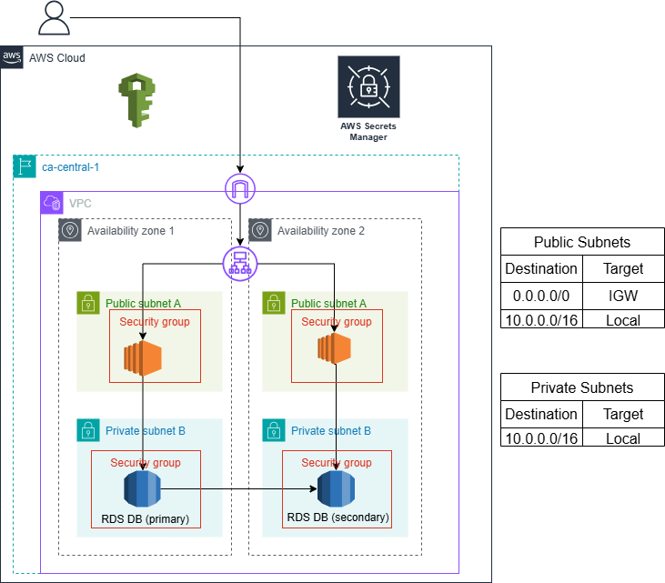

# Project 2 - AWS Migration

I was tasked to build an AWS infrastructure via Infrastructure as Code for an imaginary healthcare technology company. The infrastructure had to be highly available and secured.

## Setup instructions

## Architecture Diagram



- To meet the availability requirement, I deployed a VPC with 2 availability zones. Each availability zone contains a public and private subnet.
- The public subnet contains an EC2 instance for which access was secured with a security group.
- The private subnet contains an RDS instance for which access was also secured with a security group.
- The security group of EC2 instances allow SSH access from my IP address.
- The security group of RDS instances allow EC2 instances to access them through port 3306 (mySQL connection).
- SecretsManager is configured to generate a password for the username postgres. These credentials must be provided by the EC2 instance to connect to the RDS database.

## How to test the architecture on your local machine
1. Provide your IP address at line 27 of lib/ec2-stack.ts
2. Create a key pair with the command  ```ssh-keygen -m PEM -b 4096 -f my-key-pair -t rsa ```, which will create 2 files (my-key-pair and my-key-pair.pub in the current directory). Copy paste the content of my-key-pair.pub in line 58 of lib/ec2-stack.ts (as a string inside the brackets).
3. Run ```cdk deploy --all``` in the project2 directory
4. Start another command line and cd into the directory that contains the key-pair
5. SSH into the EC2 instance by running ```ssh -i my-key-pair ec2-user@ipv4Address``` (replace ipv4Address with the EC2 instance's public address).
6. Install mySQL using the following commands (in order):
- ```sudo amazon-linux-extras install epel -y```
- ```sudo yum install https://dev.mysql.com/get/mysql80-community-release-el7-5.noarch.rpm```
- ```sudo rpm --import https://repo.mysql.com/RPM-GPG-KEY-mysql-2023```
- ```sudo yum install mysql-community-server```
7. Check that mySQL is installed by running ```mysql --version```
8. Install jq and set it as executable
- ```wget -O jq https://github.com/stedolan/jq/releases/download/jq-1.6/jq-linux64```
- ```chmod +x ./jq```
- ```alias jq=./jq```
9. Check that jq is installed by running ```jq --version```
10. Run the following line to connect to the RDS instance:
- ```secrets=$(aws secretsmanager get-secret-value --secret-id 'db-master-user-secret' --query SecretString --output text)```
- ```username=$(echo $secrets | jq -r '.username')```
- ```password=$(echo $secrets | jq -r '.password')```
- ```mysql -h rdsEndpoint -u $username -p$password -P 3306```
Replace rdsEndpoint with the rds instance's endpoint.

You should now be connected to the RDS database

## Testing Evidence
### Screenshot of successful EC2 to RDS connection


### Screenshot of security group configurations
#### EC2 Security Group Inbound Rule

#### RDS Security Group Inbound Rule


### Evidence of successful cdk deploy and cdk destroy


